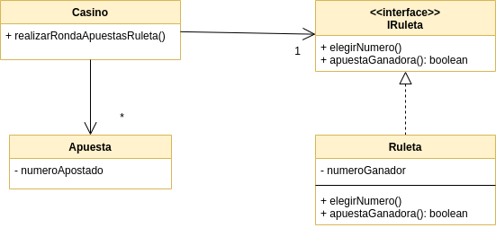

# Ejemplo de Testing con Stubs y Mocks - Ruleta


[](https://travis-ci.com/uqbar-project/eg-ruleta-xtend) [](https://coveralls.io/github/uqbar-project/eg-ruleta-xtend?branch=01-initial-flaky-tests)


## Objetivo

Muestra cómo testear con mocks y stubs cuando tenemos valores aleatorios o tenemos que evitar que manden mails cada vez que ejecutamos los tests.

## Conceptos a ver

* Testeo unitario
* Flaky tests
* Generación de stubs 
* Generación de tests de expectativa mediante el uso de mocks que provee [Mockito](http://site.mockito.org/)

## Dominio



Estamos modelando las apuestas de ruletas de un casino, para lo cual tenemos estos objetos:

- el **casino**, al que le pedimos que acepte las apuestas, y represente el giro de una ruleta, donde se determinan las apuestas ganadoras.
- la **apuesta**, que es simplemente un _value object_, un objeto que representa la información de la apuesta, consistente en el número apostado y el mail de la persona que apostó.
- y la **ruleta**, tiene la misión de determinar el siguiente número ganador (en base a la suerte y verdad) y decir si una apuesta fue ganadora o no.

## Flaky tests

Por el momento implementamos un único test, en el que configuramos una apuesta que consideramos ganadora y otra perdedora:

```xtend
	def void init() {
		apuestaPerdedora = new Apuesta() => [
			numeroApostado = 2
			casillaCorreo = "looser@roulette.com" 
		]
		apuestaGanadora = new Apuesta() => [
			numeroApostado = 5
			casillaCorreo = "winner@roulette.com" 
		]
		casino = new Casino() => [
			apostar(apuestaGanadora)
			apostar(apuestaPerdedora)
		]
	}
```

Luego, el test le pide al casino que simule el giro de una ruleta y pide que la apuesta ganadora esté en la lista de ganadores y que la perdedora no aparezca:

```xtend
	def void apuestaGanadora() {
		val ganadoras = casino.realizarRondaApuestasRuleta()
		assertTrue(ganadoras.contains(apuestaGanadora))
		assertFalse(ganadoras.contains(apuestaPerdedora))
	}
```

Claro, el problema es que la ruleta decide en base al azar:

```xtend
class Ruleta implements IRuleta {
	...
	override void girarNumero() {
		this.numeroGanador = (Math.random * 36).intValue
	}
```

entonces hay una probabilidad (baja pero cierta) de que el test de verde. En los otros casos dará rojo, lo que se conoce como [_flaky test_](https://hackernoon.com/flaky-tests-a-war-that-never-ends-9aa32fdef359).

El test no es predecible, ni cumple la propiedad de idempotencia: no es posible garantizar el mismo resultado en 1.000 ejecuciones. Ok, veremos qué podemos hacer.

 