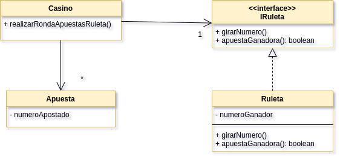

# Ejemplo de Testing con Stubs y Mocks - Ruleta


[](https://travis-ci.com/uqbar-project/eg-ruleta-xtend) [](https://coveralls.io/github/uqbar-project/eg-ruleta-xtend?branch=01-initial-flaky-tests)


## Objetivo

Muestra cómo testear con mocks y stubs cuando tenemos valores aleatorios o tenemos que evitar que manden mails cada vez que ejecutamos los tests.

## Conceptos a ver

* Testeo unitario
* Flaky tests
* Generación de stubs 
* Generación de tests de expectativa mediante el uso de mocks que provee [Mockito](http://site.mockito.org/)

## Dominio

Recordemos el diagrama de clases:



Teníamos un **flaky test** ya que cada vez que configurábamos las apuestas ganadoras y perdedoras no teníamos control sobre el número que salía en la ruleta. Ahora lo que vamos a hacer es introducir un objeto Stub, que reemplazará a la ruleta real, devolviendo el número que nosotros queremos:

```xtend
	def void init() {
		...
		casino = new Casino() => [
			// utilizamos un stub de la ruleta
			ruleta = new StubRuleta(apuestaGanadora.numeroApostado)
			//
			apostar(apuestaGanadora)
			apostar(apuestaPerdedora)
		]
	}
```

El StubRuleta se implementa aceptando un valor ganador predeterminado, algo conveniente para que la apuesta perdedora siga siéndolo:

```xtend
class StubRuleta implements IRuleta {
	int numeroGanador = 0

	new(int numeroGanador) {
		this.numeroGanador = numeroGanador
	}

	override girarNumero() {
		// no hacemos nada
	}
	
	override apuestaGanadora(Apuesta apuesta) {
		apuesta.numeroApostado === this.numeroGanador
	}
}
```

Y ahora nuestro test es predecible: la apuesta ganadora siempre es ganadora y la perdedora siempre es perdedora y cada vez que ejecutemos los tests siempre tendremos la misma respuesta. 

