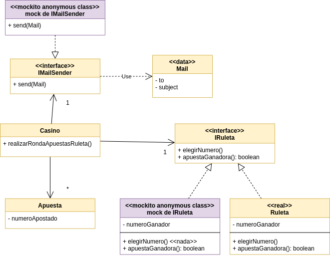

# Ejemplo de Testing con Stubs y Mocks - Ruleta


[](https://travis-ci.com/uqbar-project/eg-ruleta-xtend) [](https://coveralls.io/github/uqbar-project/eg-ruleta-xtend?branch=01-initial-flaky-tests)


## Objetivo

Muestra cómo testear con mocks y stubs cuando tenemos valores aleatorios o tenemos que evitar que manden mails cada vez que ejecutamos los tests.

## Conceptos a ver

* Testeo unitario
* Flaky tests
* Generación de stubs 
* Generación de tests de expectativa mediante el uso de mocks que provee [Mockito](http://site.mockito.org/)

## Dominio

Agregamos un requerimiento nuevo: cada vez que alguien gana a la ruleta nos interesa enviar un mail a cada ganador, con el asunto "Ganaste!".

Esto requiere que tengamos nuevos objetos:

- uno que representa un mail, es un _value object_ (solo agrupa la información, es difícil que podamos encontrarle comportamiento).

```xtend
@Data
class Mail {
	String to
	String subject
}
```

- otro que nos permite enviar un mail, no tiene aún implementación, sirve solamente como cáscara para testear.

```xtend
interface IMailSender {
	def void sendMail(Mail mail)
}
```

Además, el método principal de Casino que hace girar la ruleta y determina las apuestas ganadoras, solo va a enviarles el mail (el método pasa a ser `void`):

```xtend
def void realizarRondaApuestasRuleta() {
	ruleta.elegirNumero()
	
	apuestas
		.filter [ apuesta | ruleta.apuestaGanadora(apuesta) ]
		.toList
		.forEach [ apuesta | mailSender.sendMail(new Mail(apuesta.casillaCorreo, "Ganaste!")) ]
}
```

## Stubs y mocks

En este branch seguimos construyendo una ruleta a partir de **Mockito** que nos provee una forma de construir un objeto stub sin necesidad de definir una clase concreta. 

Ahora necesitamos también generar un _mock_ para el objeto que envía mails, ya que no tenemos ninguna implementación posible, y en el caso que la tuviéramos, no queremos mandar mails cada vez que ejecutemos los tests. Esto lo podemos hacer directamente en la clase que testea la apuesta ganadora:

```xtend
class TestApuesta {
	...
	IMailSender mockedMailSender

	@BeforeEach
	def void init() {
		...
		mockedMailSender = mock(IMailSender)
		casino = new Casino() => [
			//
			mailSender = mockedMailSender
			//
```



## Tests de comportamiento

Si el método principal `realizarRondaApuestasRuleta` es ahora void, ¿cómo podemos verificar que funciona correctamente? El _mock_ del objeto IMailSender nos va a servir para este propósito, y dijimos _mock_ y no _stub_ porque nuestros tests no van a verificar el estado final del sistema, sino la interacción de mensajes que se produce durante la fase *A*ct del test: 

```xtend
def void apuestaGanadora() {
	// Act
	val ganadoras = casino.realizarRondaApuestasRuleta()

	// Asserts
	verify(mockedMailSender, times(1))
		.sendMail(new Mail(apuestaGanadora.casillaCorreo, "Ganaste!"))
		
	verify(mockedMailSender, never)
		.sendMail(new Mail(apuestaPerdedora.casillaCorreo, "Ganaste!"))
}
```

Lo que estamos verificando es que luego de ejecutar la ronda de apuestas de la ruleta:

- se envió **exactamente 1 (un)** mensaje sendMail al objeto que mockea la interfaz IMailSender, con la casilla de correo de la apuesta ganadora y con el asunto "Ganaste!"
- y además testeamos que **nunca** se envió un mensaje sendMail con la casilla de correo de la apuesta perdedora.

De esta manera, estamos controlando la aleatoriedad de los números que salen (mock de la ruleta) y comprobamos que se envían mails a las personas correctas (mock de mail sender), generando resultados predecibles y logrando que nuestros tests sean idempotentes.
